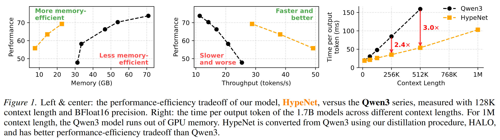
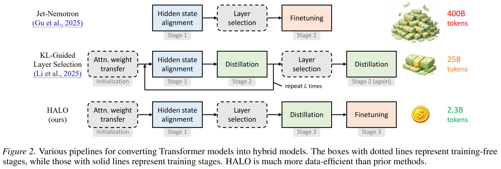
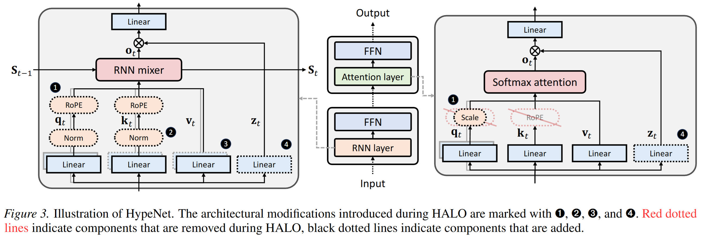

# Hybrid Linear Attention Done Right

Code and models for the paper: [Hybrid Linear Attention Done Right: Efficient Distillation and Effective Architectures for Extremely Long Contexts](https://arxiv.org/abs/2601.22156) by Yingfa Chen, Zhen Leng Thai, Zihan Zhou, Zhu Zhang, Xingyu Shen, Shuo Wang, Chaojun Xiao, Xu Han, and Zhiyuan Liu.

The main contributions of the paper is:

- 🔥 **Superior performance-efficiency tradeoff**: Compared to homogenous Transformer models such as Qwen3.
- 🚀 **Training-efficient distillation**: Converting pre-trained Transformer models into hybrid linear attention, with just 2.3B.
- 🚄 **Extremely Long Contexts**: A novel position encoding method designed specifically for hybrid models (+ various architectural improvements) for exceptional length generalization abilities.



<div align="center">
    
</div>

## HALO: An Efficient Hybrid Distillation Procedure

The distillation procedure, HALO, is as follows.



## HypeNet: An Effective Hybrid Architecture

The model architecture of HypeNet is as follows.



## How to Cite?

The following is the BibTex for citing us.

```bibtex
@misc{hybrid-linear-attention-done-right,
      title={Hybrid Linear Attention Done Right: Efficient Distillation and Effective Architectures for Extremely Long Contexts}, 
      author={Yingfa Chen and Zhen Leng Thai and Zihan Zhou and Zhu Zhang and Xingyu Shen and Shuo Wang and Chaojun Xiao and Xu Han and Zhiyuan Liu},
      year={2026},
      eprint={2601.22156},
      archivePrefix={arXiv},
      primaryClass={cs.CL},
      url={https://arxiv.org/abs/2601.22156}, 
}
```